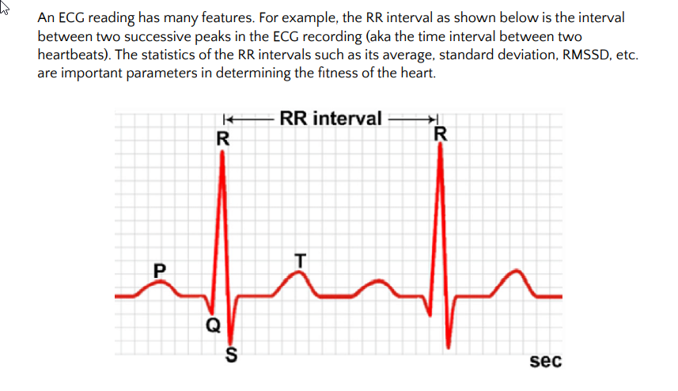

# Measuring-Heart-Rhythm-Disorders
The most common way of analysing the functioning of a heart is to do an Electrocardiogram (ECG) measurement. This ECG reading is used by cardiologists to identify heart rhythm disorders and other abnormalities. For example, ECGs are commonly used to detect the presence of arrhythmias in patients. If present and not treated in time, these arrhythmias can lead to stroke and possibly heart failure.

## Feature Extraction
Use heartpy package to extract the features from raw ECG singnal

